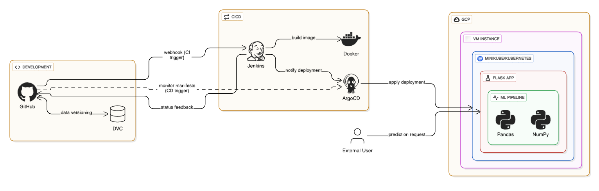

# kubernetes-mlops

CVE ingest and query platform on EKS: a Job publishes NVD JSON to Kafka, a
consumer hashes it into Postgres, an operator turns GitHub delta releases into
more Jobs, and a RAG service answers questions with Ollama `llama3.1:8b`.

```
CVE List V5 zip / GitHub _delta_ releases
        |
        v
cve-operator  -->  webapp-cve-processor (Job)  --Kafka-->  webapp-cve-consumer
                                                              |
                                                              v
                                                           Postgres
        |
        v
webapp-llm  (Pinecone + Ollama llama3.1:8b)
```

| Path | What it is |
|---|---|
| `apps/webapp-cve-processor` | Go Job: download CVE JSON, produce to Kafka |
| `apps/webapp-cve-consumer` | Go consumer: SHA-256 upsert into Postgres |
| `apps/webapp-llm` | Flask RAG + Streamlit, MiniLM / Pinecone / Ollama |
| `apps/cve-operator` | Kubebuilder operator (`GithubReleaseMonitor`, `GithubRelease`) |
| `apps/static-site` | Caddy static site |
| `charts/` | Helm charts for the apps, operator, and cluster autoscaler |
| `infra/infra-aws` | Terraform: VPC, EKS 1.29, Kafka, Postgres, Istio, Fluent Bit |
| `infra/infra-jenkins` | Terraform: Jenkins EC2 |
| `infra/ami-jenkins` | Packer AMI with Jenkins |
| `infra/k8s-yaml-manifests` | Raw ConfigMap / Secret / Pod / Service samples |
