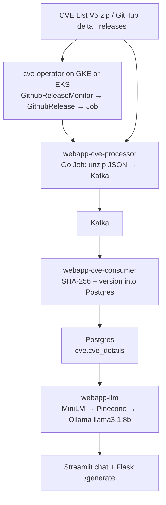
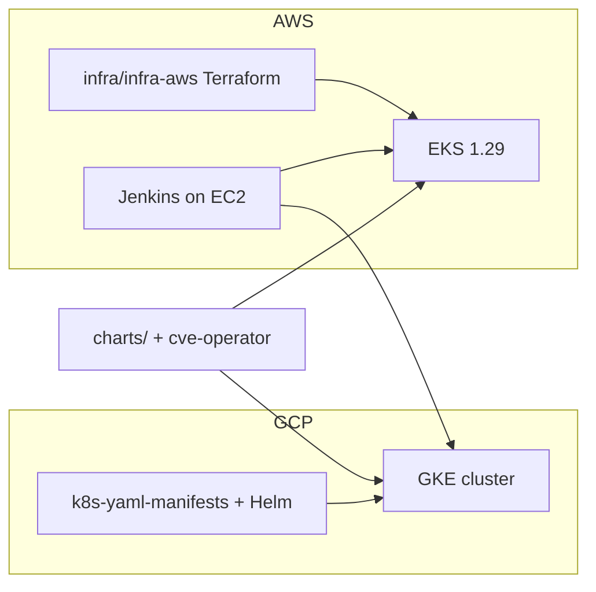

# kubernetes-mlops

A Kubernetes MLOps platform that **ingests CVE List V5 data**, **stores it in Postgres**, and **answers questions about those CVEs with a local LLM**.

Workloads are plain Kubernetes: they run on **Google Kubernetes Engine (GKE) on GCP** and on **Amazon EKS**. Helm charts and the CVE operator talk only to the Kubernetes API and GitHub, so the same images install on either cluster. Terraform in this repo (`infra/infra-aws`) builds the EKS side; GKE is the GCP cluster the YAML/Helm path targets.

There is a second, smaller track: a sklearn pipeline that classifies factory **efficiency** from sensor CSV and serves the model from Flask.

---

## What the CVE platform does

NVD publishes CVE records as JSON in [CVE List V5](https://github.com/CVEProject/cvelistV5). This project treats those records as a streaming dataset:

1. A Kubernetes **Job** (`webapp-cve-processor`) downloads a zip of CVE JSON, walks every record, and **produces each document onto Kafka**.
2. A long-running **consumer** (`webapp-cve-consumer`) reads Kafka, hashes each payload with **SHA-256**, and **upserts** into Postgres. Duplicate hashes are skipped; a changed payload for the same `cveId` is stored as a new version.
3. The **cve-operator** watches GitHub releases. When it sees a `_delta_` zip newer than `monitorFrom`, it creates a `GithubRelease` CR, which creates another processor Job so the cluster stays current without a full re-ingest.
4. **webapp-llm** embeds CVE text with MiniLM, stores vectors in **Pinecone**, and answers questions through **Ollama** (`llama3.1:8b`) using LangChain RetrievalQA. Streamlit is the chat UI; Flask is the `/generate` API.



Postgres schema (`cve.cve_details`): `cve_id`, `cve_data` (JSONB), `version`, `cve_data_hash`. Flyway runs from an init container before the consumer starts.

---

## CVE operator

`apps/cve-operator` is a Kubebuilder / controller-runtime operator. API group **`mlops.ajay.io/v1`**. It does not scrape NVD itself; it turns GitHub release metadata into Kubernetes Jobs that run `webapp-cve-processor`.

The manager binary (`cmd/main.go`) loads in-cluster config **or** kubeconfig, including the GCP auth plugin so the same binary can talk to **GKE**. Health probes are `/healthz` and `/readyz` on `:8081`. Leader election is available so only one replica creates Jobs.

### Custom resources

| Kind | Spec | What the controller does |
|---|---|---|
| `GithubReleaseMonitor` | `url` (GitHub releases API), `monitorFrom` (RFC3339) | Every **2 minutes**, GET the releases URL with `GITHUB_TOKEN`, keep assets whose name contains `_delta_` and `published_at` is after `monitorFrom`. For each new zip, create a `GithubRelease`. Status lists each release as `processed successfully`, `already processed`, or `processing failed`. Failed `GithubRelease` objects are deleted and recreated. |
| `GithubRelease` | `url` (direct zip download) | If no Job exists for that URL, create a `batch/v1` Job. Status tracks `active`, `jobReference`, `lastScheduleTime`, and Complete/Failed conditions. On delete, the finalizer garbage-collects owned Jobs. |

Helm installs a monitor after the chart lands (`charts/helm-cve-operator/templates/Release-Monitor.yaml`, hook `post-install`):

```yaml
apiVersion: mlops.ajay.io/v1
kind: GithubReleaseMonitor
metadata:
  name: githubreleasemonitor
  namespace: cve-operator
spec:
  url: https://api.github.com/repos/CVEProject/cvelistV5/releases
  monitorFrom: "2024-08-07T16:00:00Z"
```

### Job the operator creates

Each `GithubRelease` owns a Job named from the zip filename. The pod:

- Pulls `ajay6601/cve-webapp:latest` (image pull secret `docker-secret`)
- Sets `CVE_DATA_URL` to the delta zip
- Reads Kafka host / user / password / topic from `kafka-secret`
- Uses `RestartPolicy: OnFailure`, backoff limit 3
- Annotates Istio `holdApplicationUntilProxyStarts` so the producer does not race the sidecar

The processor Job then follows the same path as a manual ingest: unzip → Kafka → consumer → Postgres.

### Deploy

On **GKE or EKS**:

```sh
# from apps/cve-operator
make docker-build docker-push IMG=ajay6601/cve-operator:latest
make install          # CRDs
helm upgrade --install cve-op charts/helm-cve-operator
```

CRDs live under `apps/cve-operator/config/crd/bases/` (`githubreleasemonitors` and `githubreleases`). Image in values: `ajay6601/cve-operator`.

---

## GCP / GKE and AWS / EKS

The apps, Helm charts, and operator are cluster-agnostic. Two places they actually run:

### GKE (Google Cloud)

GKE is the GCP Kubernetes cluster. Same `kubectl` / Helm install as any other cluster:

- `infra/k8s-yaml-manifests` — ConfigMap, dockerconfigjson Secret, Caddy Pod, NodePort Service. Apply with `kubectl apply -f .` (works on GKE or minikube).
- Helm charts in `charts/` — processor, consumer, LLM, operator, cluster autoscaler.
- Operator uses `k8s.io/client-go/plugin/pkg/client/auth` (GCP included), so `gcloud container clusters get-credentials` is enough for local `make deploy`.
- Services can be `NodePort` or `LoadBalancer` (GCLB on GKE).

Typical GKE path: create the cluster in a GCP project, get credentials, apply YAML or Helm, let the operator create processor Jobs into Kafka/Postgres running in that cluster.

### EKS (AWS)

`infra/infra-aws` is Terraform for a full EKS 1.29 environment: VPC, IRSA, CPU node group plus a GPU group (`g5g.xlarge`) for Ollama, then Helm for:

- Bitnami Kafka and PostgreSQL HA
- Istio (base, istiod, gateway), cert-manager, external-dns
- kube-prometheus-stack, Fluent Bit → CloudWatch
- Cluster autoscaler, Ollama

Jenkins is **not** in-cluster: Packer AMI (`infra/ami-jenkins`) + EC2 (`infra/infra-jenkins`). Each app/chart Jenkinsfile builds, pushes to Docker Hub, and deploys the chart onto the kubeconfig Jenkins is given (GKE or EKS).



---

## Factory efficiency model

Independent of the CVE path. Classic train → artifact → serve on Kubernetes.

| Piece | What it does |
|---|---|
| `src/data_processing.py` | Load CSV, encode operation/efficiency fields, scale, train/test split |
| `src/model_training.py` | Logistic regression, dump `artifacts/models/model.pkl` |
| `pipeline/training_pipeline.py` | Runs process then train |
| `application.py` | Flask form that predicts High / Medium / Low efficiency |
| Root `Dockerfile` / `Jenkinsfile` | Image `ajay6601/kubernetes-mlops`, push to Docker Hub, Argo CD sync |

---

## Repository layout

| Path | What it is |
|---|---|
| `apps/cve-operator` | Kubebuilder operator: `GithubReleaseMonitor` + `GithubRelease` → processor Jobs |
| `apps/webapp-cve-processor` | Go Job: download CVE zip, produce JSON to Kafka |
| `apps/webapp-cve-consumer` | Go consumer: SHA-256 idempotent writes to Postgres |
| `apps/webapp-llm` | Flask RAG + Streamlit UI (Pinecone, MiniLM, Ollama) |
| `apps/static-site` | Caddy static site |
| `charts/helm-cve-operator` | Helm chart: CRDs, manager, RBAC, post-install monitor CR |
| `charts/` | Helm charts for processor, consumer, LLM, autoscaler |
| `infra/k8s-yaml-manifests` | Raw ConfigMap / Secret / Pod / Service for GKE (or minikube) |
| `infra/infra-aws` | Terraform: VPC, EKS, Kafka, Postgres, Istio, observability, Ollama |
| `infra/infra-jenkins` | Terraform: Jenkins EC2 |
| `infra/ami-jenkins` | Packer AMI with Jenkins and job DSLs |
| `src/`, `pipeline/`, `application.py` | Efficiency classifier training and Flask serving |

Go modules: `github.com/Ajay6601/kubernetes-mlops/apps/{cve-operator,webapp-cve-processor,webapp-cve-consumer}`.
